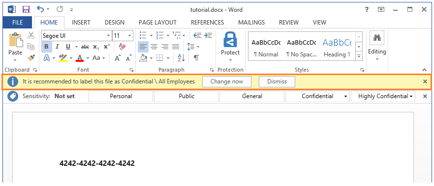

# 4단계: 실제 분류, 레이블 지정 및 보호 작동 방식 확인 

>*적용 대상: [Azure Information Protection](https://azure.microsoft.com/pricing/details/information-protection)*

설치된 Azure Information Protection 클라이언트로 연 Word 문서가 있으므로 구성한 정책을 사용하여 문서에 레이블을 지정하고 문서를 보호하기가 얼마나 쉬운지 확인할 준비가 되었습니다.

문서를 저장하면 분류와 보호가 발생합니다. 그러나 그 전에 저장되지 않은 문서를 사용하여 레이블을 적용하고 변경하기가 얼마나 쉬운지 확인합니다.

## 수동으로 기본 레이블을 변경하려면

Information Protection 표시줄에서 마지막 레이블을 선택하면 하위 레이블이 표시되는 방식이 나타납니다.

이러한 하위 레이블 중 하나를 선택하면 이 문서에 대한 레이블을 선택했으므로 표시줄에서 다른 레이블이 표시되는 방식을 더 이상 볼 수 없습니다. **민감도** 값이 레이블 및 하위 레이블 이름을 표시하도록 변경되며 레이블 색도 그에 맞게 변경됩니다. 예를 들면 다음과 같습니다.

Information Protection 표시줄에서 현재 선택된 레이블 값 옆에 있는 **레이블 편집** 아이콘을 클릭합니다.

사용 가능한 레이블이 다시 표시됩니다.

이제 첫 번째 레이블 **개인**을 선택합니다. 이 문서에 대해 이전에 선택한 레이블보다 낮은 분류 수준에 있는 레이블을 선택했으므로 분류 수준을 낮춘 이유를 제시하라는 메시지가 표시됩니다.

**The previous label no longer applies**(이전 레이블이 더 이상 적용 안 됨)를 선택하고 **Confirm**(확인)을 클릭합니다. **민감도** 값이 **개인**으로 변경되고 다른 레이블은 다시 숨겨집니다.

## 분류를 완전히 제거하려면

Information Protection 표시줄에서 **레이블 편집** 아이콘을 다시 클릭합니다. 그러나 레이블 중 하나를 선택하는 대신 **레이블 삭제** 아이콘을 클릭합니다.

이번에는 확인 메시지가 표시되면 “이 문서는 분류할 필요가 없습니다.”를 입력하고 **확인**을 클릭합니다.  

**민감도** 값에 **설정 안 함**이 표시되며, 이는 기본 레이블을 설정하지 않은 경우 사용자에게 처음에 표시되는 내용입니다.

## 레이블 지정 및 자동 보호에 대한 권장 메시지를 확인하려면

1. Word 문서에서 유효한 신용 카드 번호(예: **4242-4242-4242-4242**)를 입력합니다. 

2. 원하는 파일 이름으로 문서를 로컬에 저장합니다. 

3. 이제 신용 카드 번호가 감지될 경우 보호를 위해 구성한 레이블을 적용하기 위한 프롬프트가 표시됩니다. 권장 사항에 동의하지 않은 경우 정책 설정에서는 **해제**를 선택하여 거부할 수 있게 합니다. 권장 사항을 제공하되, 사용자가 권장 사항을 재정의할 수 있게 하면 자동 분류 사용 시 가양성을 줄이는 데 도움이 됩니다. 이 자습서에서는 **지금 변경**을 클릭합니다.

    

    이제 문서에서 구성된 레이블이 적용(예: **기밀 \ 금융**)된 것을 볼 수 있을 뿐만 아니라 페이지에 걸쳐 조직 이름의 워터마크를 즉시 볼 수 있으며 **기밀로 분류됨** 바닥글도 적용된 것을 볼 수 있습니다. 

    또한 문서는 이 레이블에 지정한 권한으로 보호됩니다. **파일** 탭을 클릭하고 **문서 보호**에 대한 정보를 확인하여 문서가 보호되는지 확인할 수 있습니다. 문서가 **기밀 \ 금융**으로 보호되는 것과 레이블 설명을 확인할 수 있습니다. 
    
    레이블의 보호 구성 때문에 직원만 문서를 열 수 있으며 직원의 일부 작업이 제한됩니다. 예를 들어 인쇄 권한과 콘텐츠 복사 및 추출 권한이 없으므로 문서를 인쇄하거나 문서에서 복사할 수 없습니다. 이러한 제한은 데이터 손실을 방지하는 데 도움이 됩니다. 문서의 소유자는 문서를 인쇄하고 복사할 수 있습니다. 그러나 조직의 다른 사용자에게 문서를 메일로 보내는 경우 받는 사용자는 이러한 작업을 수행할 수 없습니다.

4. 이제 이 문서를 닫을 수 있습니다.

지금까지 분류, 레이블 지정 및 보호 작업 방식에 대해 살펴보았으므로 이제 다른 조직의 다른 사용자와 문서를 공유할 때 보호하는 방법에 대해 확인해 보겠습니다. 문서의 사용 방식과 액세스에 대한 취소 방식을 추적할 수도 있습니다.

|자세한 정보가 필요한 경우|추가 정보|
|--------------------------------|--------------------------|
|파일 레이블 지정 및 보호에 대한 전체 지침 |[파일 또는 전자 메일 분류 및 보호](./rms-client/client-classify-protect.md)|
|레이블 활동 로깅 위치 |[Azure Information Protection 클라이언트에 대한 사용 현황 로깅](./rms-client/client-admin-guide-files-and-logging.md#usage-logging-for-the-azure-information-protection-client)|

>[!div class="step-by-step"]
[&#171;3단계](infoprotect-tutorial-step3.md)
[5단계 &#187;](infoprotect-tutorial-step5.md)
